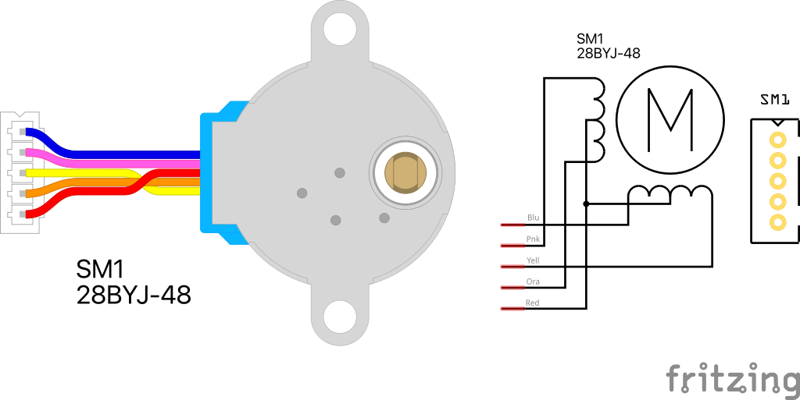

# 28BYJ-48 Stepper Motor
A fritzing part for the 28BYJ-48 Stepper Motor with its JST connector and all the wiring done correctly. Includes also the schematic symbol and the pcb footprint.

Have a look at the [28BYJ-48 ULN2003 driver module part](../28BYJ-48-driver/) also.

## NOTE
The connector pins are marked as **male** instead of the correct **female** type as a trick to *help* Fritzing connect it to the driver module more easily (where the same trick is applied).

## LICENSE

This work is licensed under the [GNU General Public License v3.0](../LICENSE-GPLV30). All media and data files that are not source code are licensed under the [Creative Commons Attribution 4.0 BY-SA license](../LICENSE-CCBYSA40).

More information about licenses in [Opensource licenses](https://opensource.org/licenses/) and [Creative Commons licenses](https://creativecommons.org/licenses/).
