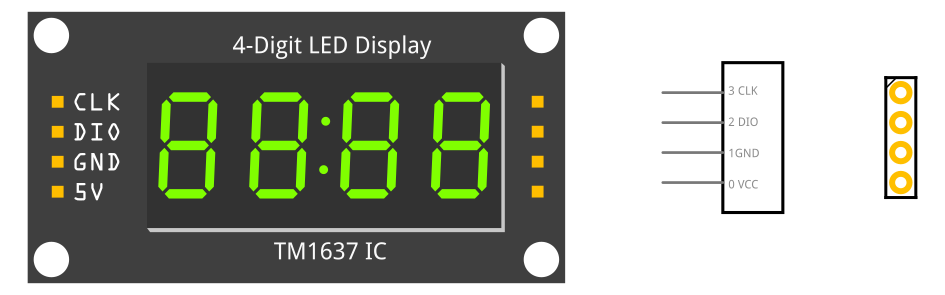

# 4-digit 7-segment LED display
A fritzing part of a 4-digit 7-segment LED display driven by a TM1637 IC controller in a brekout board. 4-pin connection operated via 1-wire protocol (a simplified version of I2C protocol).

\[[Download link](4-digit-display_Rt.fzpz)\]

## LICENSE

This work is licensed under the [GNU General Public License v3.0](../LICENSE-GPLV30). All media and data files that are not source code are licensed under the [Creative Commons Attribution 4.0 BY-SA license](../LICENSE-CCBYSA40).

More information about licenses in [Opensource licenses](https://opensource.org/licenses/) and [Creative Commons licenses](https://creativecommons.org/licenses/).
